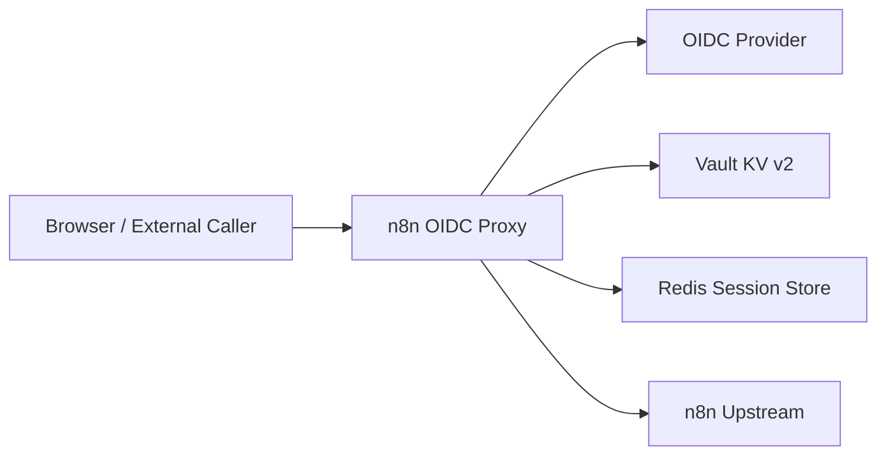
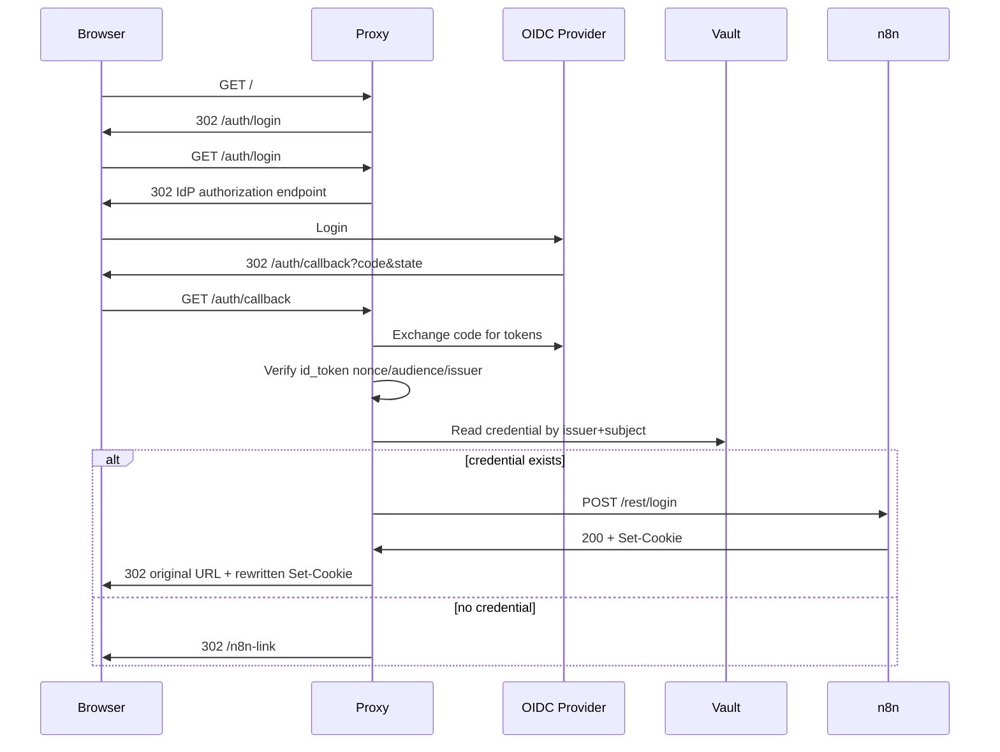
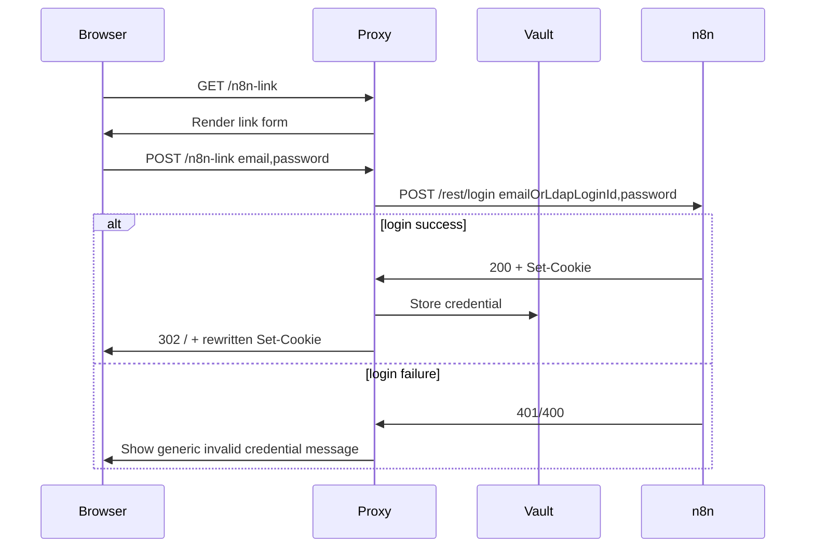
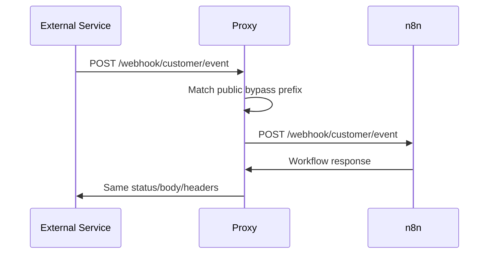
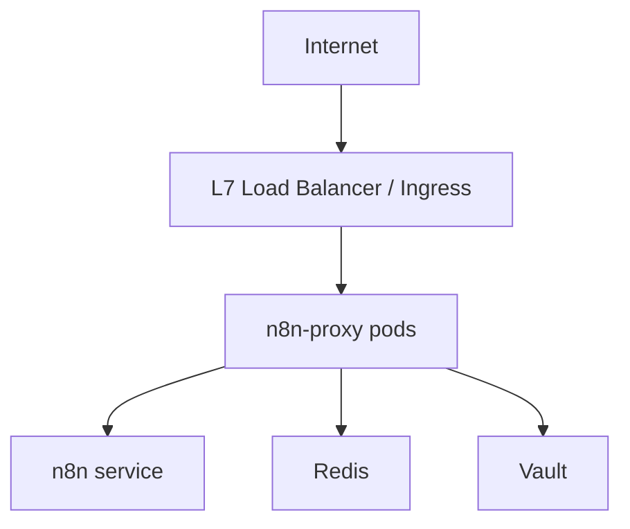

# 아키텍처

## 구성요소



## 요청 분류

프록시는 모든 inbound request를 아래 순서로 분류한다.

1. Proxy internal route: `/auth/*`, `/n8n-link`, `/healthz`, `/readyz`
2. Public n8n execution route: `/webhook/*`, `/webhook-test/*`, `/webhook-waiting/*`, `/form/*`, `/form-test/*`, `/forms/*`, `/forms-test/*`
3. Blocked native login route: external `POST /rest/login`, native login page aliases
4. Protected n8n console/API route: 그 외 모든 route

분류 순서는 보안 정책이다. public execution route를 protected route보다 먼저 판정해야 webhook 호출이 OIDC redirect로 깨지지 않는다. 반대로 `/rest/login`은 protected proxying 전에 차단해야 직접 로그인을 막을 수 있다.

## 인증 상태

프록시는 두 종류의 세션을 다룬다.

### Proxy OIDC session

- 쿠키 이름: `__Host-n8np_session`
- Cookie attributes: HTTPS에서는 `Secure; HttpOnly; SameSite=None; Path=/`, 로컬 HTTP에서는 fallback `n8np_session`에 `HttpOnly; SameSite=Lax; Path=/`
- 저장소: Redis
- 값: opaque random session id
- Redis value:

```json
{
  "issuer": "https://idp.example.com",
  "subject": "oidc-subject",
  "email": "user@example.com",
  "name": "User Name",
  "linked": true,
  "created_at": "2026-06-14T00:00:00Z",
  "expires_at": "2026-06-14T08:00:00Z"
}
```

### n8n session

- n8n upstream이 발급하는 쿠키다.
- 프록시는 쿠키 값을 해석하지 않는다.
- 프록시는 `Set-Cookie` attribute만 public host에 맞게 재작성한다.
- 브라우저가 이후 요청에 n8n cookie를 실어 보내면 프록시는 그대로 upstream에 전달한다.

## 로그인 플로우



## 계정 연결 플로우



## Webhook/form 바이패스 플로우



Webhook/form 요청에는 OIDC, proxy session, n8n browser session을 요구하지 않는다. 이 요청들은 n8n workflow 자체의 인증 설정(Header Auth, Basic Auth, query token 등)에 맡긴다.

## Route table

| Method | Path | Owner | Auth | Behavior |
| --- | --- | --- | --- | --- |
| GET | `/auth/login` | Proxy | None | OIDC authorization redirect |
| GET | `/auth/callback` | Proxy | OIDC state | Token exchange, Vault lookup, n8n login |
| POST | `/auth/logout` | Proxy | Proxy session | Clear proxy session, call n8n logout best-effort |
| POST | `/rest/logout` | Proxy | Browser cookies | Call n8n logout best-effort, keep proxy session, clear n8n bridge marker |
| GET | `/signout` | Proxy | Browser cookies | Keep proxy session, clear n8n bridge marker, redirect home |
| GET | `/n8n-link` | Proxy | Proxy session | Render credential link form |
| POST | `/n8n-link` | Proxy | Proxy session + CSRF | Validate n8n credential, store in Vault |
| DELETE | `/n8n-link` | Proxy | Proxy session + CSRF | Delete Vault mapping |
| ANY | `/webhook/*` | n8n | None at proxy | Direct bypass |
| ANY | `/webhook-test/*` | n8n | None at proxy | Direct bypass |
| ANY | `/webhook-waiting/*` | n8n | None at proxy | Direct bypass |
| ANY | `/form/*` | n8n | None at proxy | Direct bypass |
| ANY | `/form-test/*` | n8n | None at proxy | Direct bypass |
| ANY | `/forms/*` | n8n | None at proxy | Direct bypass |
| ANY | `/forms-test/*` | n8n | None at proxy | Direct bypass |
| POST | `/rest/login` | Blocked | N/A | Return 404 or 403 for external caller |
| ANY | `/*` | n8n | Proxy session + n8n bridge marker | Protected reverse proxy; bridge n8n login when marker is missing |

## Deployment topology

권장 배포는 아래와 같다.



n8n upstream은 public internet에 직접 노출하지 않는다. 운영자 native login이 필요하면 VPN, bastion, private ingress 등 별도 경로로 제한한다.
